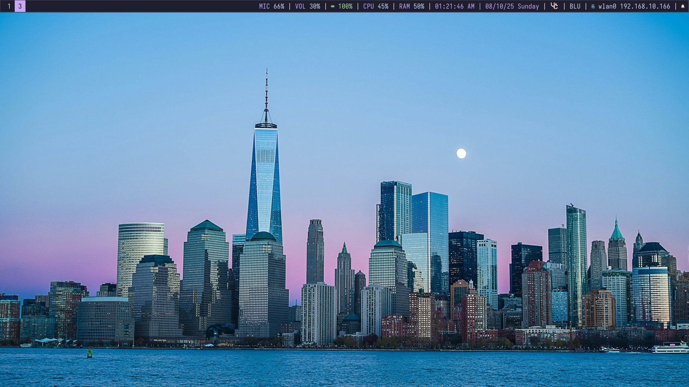

<div align="center">

# CG i3 Dotfiles

*A complete, unified desktop environment for productivity enthusiasts*

[](https://github.com/cyber-green/cg-i3dotfiles/stargazers)
[](https://github.com/cyber-green/cg-i3dotfiles/network)
[](LICENSE)
[]()

[Features](#features) • [Screenshots](./screenshots/) • [Installation](#installation) • [Configuration](#configuration) • [Keybindings](#keybindings)

</div>

---

## Overview

A carefully crafted desktop environment configuration for Linux featuring i3 window manager, Polybar status bar, Neovim editor, i3lock screen locker, and Fish shell. All components work together with a consistent **Catppuccin Mocha** theme for a cohesive and productive workflow.

## Screenshots

<details>
<summary>Desktop View 1</summary>

</details>

<details>
<summary>Desktop View 2</summary>

</details>

## Features

<details>
<summary><b>Visual Design</b></summary>

- **Consistent theming** with Catppuccin Mocha across all components
- **Iosevka Nerd Font** for clean typography and rich icon support
- **Advanced i3lock themes** with blur effects and custom backgrounds
- **Two-line Fish prompt** with Git status and system information
- **Smooth animations** and transitions where supported

</details>

<details>
<summary><b>Productivity Features</b></summary>

- **i3 Window Manager**
  - Intuitive vim-like keybindings
  - Multi-monitor support with workspace management
  - Auto-launching of essential services
  - Multiple application launcher options (rofi, fuzzel, wofi)

- **Polybar Status Bar**
  - Interactive modules for system control
  - Real-time monitoring (CPU, memory, GPU, battery, network)
  - Audio and microphone controls with click actions
  - Notification management integration

- **Neovim Editor**
  - Optimized startup time with lazy loading
  - LSP integration for multiple languages
  - Fuzzy finding and file management
  - Integrated terminal and Git support

- **Fish Shell**
  - 100+ useful aliases and abbreviations
  - Smart command completion and history
  - Custom functions for common tasks
  - Enhanced navigation and file operations

</details>

<details>
<summary><b>System Integration</b></summary>

- **Audio Management**: PulseAudio integration with visual controls
- **Notification System**: Dunst with pause/resume functionality  
- **Screen Locking**: Multiple i3lock themes (simple and advanced)
- **Display Management**: Multi-monitor setup scripts
- **File Operations**: Enhanced archive extraction and file utilities
- **Git Integration**: Status in prompt and editor workflows
- **Theme Consistency**: Dark theme applied system-wide

</details>

## Requirements

<details>
<summary><b>Core Components</b></summary>

- `i3-wm` - Window manager
- `polybar` - Status bar
- `i3lock-color` - Screen locker (or i3lock for basic functionality)
- `neovim` (>= 0.9.0) - Text editor
- `fish` - Shell
- `git` - Version control

</details>

<details>
<summary><b>System Utilities</b></summary>

- `kitty` - Terminal emulator
- `rofi`/`fuzzel`/`wofi` - Application launchers
- `fastfetch` - System info display
- `feh` - Wallpaper management
- `dunst` - Notification daemon
- `flameshot` - Screenshots
- `xrandr` - Display configuration
- `pulseaudio` + `pactl` - Audio system
- `imagemagick` - `i3lock` effects

</details>

<details>
<summary><b>Development & Shell Tools</b></summary>

- `ripgrep` - Fast text search
- `nodejs` + `npm` - LSP servers
- `curl` + `wget` - Downloads
- `xdg-utils` - URL handling
- `p7zip` + `unrar` - Archive support
- `yt-dlp` - Video downloads
- `intel-gpu-tools` - GPU monitoring (Intel only)
- `boomer` - `Zoomer` application for Linux

</details>

<details>
<summary><b>Fonts</b></summary>

- Iosevka Nerd Font (primary)
- Any Nerd Font compatible font

</details>

## Installation

<details>
<summary><b>Arch Linux / CachyOS</b></summary>

```bash
# Essential packages
sudo pacman -S i3-wm polybar i3lock-color neovim fish git kitty fish dmenu feh \
  dunst flameshot xorg-xrandr pulseaudio fastfetch imagemagick intel-gpu-tools \
  ripgrep nodejs npm curl wget xdg-utils p7zip unrar yt-dlp

# packages (AUR)
yay -S ttf-iosevka-nerd
paru -S boomer
```

</details>

<details>
<summary><b>Ubuntu/Debian</b></summary>

```bash
# Essential packages
sudo apt update
sudo apt install i3 polybar i3lock neovim fish git kitty dmenu feh dunst \
  flameshot x11-xserver-utils pulseaudio fastfetch imagemagick intel-gpu-tools \
  ripgrep nodejs npm curl wget xdg-utils p7zip-full unrar-free yt-dlp

# NOTE: Install Nerd Fonts and boomer manually or via package manager if available
```

</details>

<details>
<summary><b>Fedora</b></summary>

```bash
# Essential packages
sudo dnf install i3 polybar i3lock neovim fish git kitty dmenu feh dunst \
  flameshot xrandr pulseaudio fastfetch ImageMagick intel-gpu-tools \
  ripgrep nodejs npm curl wget xdg-utils p7zip unrar yt-dlp
```

</details>

## Setup

1. Clone the repository:
   ```bash
   git clone https://github.com/cyber-green/cg-i3dotfiles.git
   cd cg-i3dotfiles
   ```

2. Run the installation script:
   ```bash
   chmod +x install
   ./install
   ```

3. Reload your environment:
   - Log out and back into i3 session
   - Reload i3: `Super + Shift + r`
   - Open new terminal for Fish shell changes

## Configuration

Each component can be customized by editing its respective configuration files:

| Component | Configuration Files | Purpose |
|-----------|-------------------|----------|
| **i3** | `config/i3/config` | Keybindings, workspace setup, autostart programs |
| **Polybar** | `config/polybar/config.ini` | Modules, colors, fonts, bar appearance |
| **i3lock** | `config/i3lock/theme.conf` | Colors, fonts, blur effects, background options |
| **Neovim** | `config/nvim/init.lua` | Plugin management and core configuration |
| **Fish** | `config/fish/config.fish` | Aliases, functions, prompt customization |

## Keybindings

<details>
<summary><b>i3 Window Manager</b></summary>

| Key Combination | Action |
|-----------------|--------|
| `Super + Return` | Open terminal (kitty) |
| `Super + d` | Open rofi application launcher |
| `Super + Shift + f` | Open fuzzel launcher |
| `Super + b` | open `bommer` zoomer application |
| `Super + Ctrl + d` | Open wofi launcher |
| `Super + p` | Open rofi run menu |
| `Super + Ctrl + w` | Open rofi window switcher |
| `Super + m` | Open launcher menu script |
| `Super + q` | Close focused window |
| `Super + j/k/l/;` | Navigate windows (vim-like) |
| `Super + Arrow keys` | Navigate windows (arrow keys) |
| `Super + Shift + j/k/l/;` | Move windows (vim-like) |
| `Super + Shift + Arrow keys` | Move windows (arrow keys) |
| `Super + 1-9/0` | Switch to workspace |
| `Super + Shift + 1-9/0` | Move window to workspace |
| `Super + h` | Split horizontal |
| `Super + v` | Split vertical |
| `Super + f` | Toggle fullscreen |
| `Super + w` | Toggle polybar visibility |
| `Super + e` | Toggle split layout |
| `Super + Shift + space` | Toggle floating |
| `Super + space` | Toggle focus (tiling/floating) |
| `Super + a` | Focus parent container |
| `Super + r` | Enter resize mode |
| `Super + Shift + c` | Reload configuration |
| `Super + Shift + r` | Restart i3 |
| `Super + Shift + e` | Exit i3 |
| `Super + Shift + l` | Lock screen (simple) |
| `Super + z` | Open zen-browser |
| `Super + Shift + d` | Open vesktop (Discord) |
| `Print` | Take screenshot (flameshot) |

</details>

<details>
<summary><b>Neovim</b></summary>

| Key Combination | Action |
|-----------------|--------|
| `Space` | Leader key |
| `Shift + h/l` | Previous/Next buffer |
| `Leader + q/Q` | Close buffer (normal/force) |
| `Leader + f` | Find files in current directory |
| `Leader + g` | Grep search |
| `Leader + t` | Toggle file explorer |
| `Leader + z` | Open floating terminal |
| `Leader + p` | Cycle color themes |
| `Leader + w` | Save file |
| `Leader + s` | Search and replace |
| `Ctrl + h/j/k/l` | Navigate windows |
| `Alt + 1-9` | Go to buffer by number |

</details>

<details>
<summary><b>Fish Shell Aliases</b></summary>

| Alias | Command | Description |
|-------|---------|-------------|
| `ll` | `ls -la` | Detailed file listing |
| `la` | `ls -a` | Show all files including hidden |
| `cls/c` | `clear` | Clear terminal |
| `nv` | `nvim` | Open Neovim |
| `g` | `git` | Git shorthand |
| `ga` | `git add` | Stage changes |
| `gc` | `git commit` | Commit changes |
| `gp` | `git push` | Push to remote |
| `gs` | `git status` | Show git status |
| `sys-upgrade` | Full system update | Update packages (Arch-based) |
| `dv` | `yt-dlp --no-playlist` | Download video |
| `done` | `git add . && git commit && git push` | Quick commit and push |

</details>

<details>
<summary><b>Fish Shell Functions</b></summary>

| Function | Description |
|----------|-------------|
| `extract <file>` | Extract any archive format |
| `ff <pattern>` | Find files by name |
| `psg <process>` | Search running processes |
| `weather [city]` | Get weather information |

</details>

## Project Structure

```
cg-i3dotfiles/
├── install                    # Installation script
├── README.md                  # This documentation
└── config/
    ├── fish/                  # Fish shell configuration
    │   ├── config.fish       # Main fish config with aliases and functions
    │   ├── conf.d/           # Additional fish configurations
    │   │   ├── deno.fish     # Deno environment setup
    │   │   └── rustup.fish   # Rust toolchain setup
    │   ├── fish_variables    # Fish shell variables
    │   ├── cg-fish.png       # Fish shell screenshot
    │   └── README.md         # Fish-specific documentation
    ├── fuzzel/               # Fuzzel wayland launcher
    │   └── fuzzel.ini        # Fuzzel configuration
    ├── i3/                   # i3 window manager configuration
    │   ├── config            # Main i3 configuration
    │   ├── launcher-menu.sh  # Custom launcher menu script
    │   └── set-dark-theme.sh # Dark theme setup script
    ├── i3lock/               # Screen lock configurations
    │   ├── theme.conf        # Theme settings for advanced lock
    │   ├── lock-simple.sh    # Simple lock script
    │   ├── lock-advanced.sh  # Advanced lock with blur effects
    │   └── lock.sh           # Default lock script
    ├── nvim/                 # Neovim configuration
    │   ├── init.lua          # Main Neovim configuration
    │   ├── lua/config/       # Core configuration modules
    │   ├── lua/plugins/      # Plugin configurations
    │   ├── LICENSE           # Neovim config license
    │   └── README.md         # Detailed Neovim documentation
    ├── polybar/              # Polybar status bar
    │   ├── config.ini        # Main polybar configuration
    │   ├── scripts/          # Custom polybar scripts
    │   │   └── intel-gpu-usage.sh # Intel GPU monitoring script
    │   ├── launch_polybar.sh # Polybar startup script
    │   ├── start_polybar.sh  # Alternative startup script
    │   ├── kill_polybar.sh   # Kill polybar processes
    │   ├── toggle_polybar.sh # Toggle polybar visibility
    │   ├── mic-input.sh      # Microphone status script
    │   ├── mic-volume.sh     # Microphone volume script
    │   ├── cg-polybar*.png   # Polybar screenshots
    │   └── README.md         # Polybar-specific documentation
    ├── rofi/                 # Rofi application launcher
    │   └── config.rasi       # Rofi configuration and styling
    └── wofi/                 # Wofi wayland launcher
        ├── config            # Wofi configuration
        └── style.css         # Wofi styling
```

## Polybar Modules

- **Workspaces**: Interactive workspace indicator
- **Window Title**: Shows active window title
- **Microphone**: Clickable microphone control with mute toggle
- **Audio**: Volume control with click-to-mute and scroll adjustment
- **System Monitoring**: CPU and memory usage
- **Intel GPU**: Real-time GPU usage and frequency (Intel only)
- **Battery**: Battery status with charging indicators
- **Network**: Wireless network information
- **Notifications**: Dunst notification control (pause/resume)
- **Date/Time**: Current date and time display

## Customization Tips

### Changing Themes
- **i3lock**: Edit `config/i3lock/theme.conf` to modify colors, fonts, and effects
- **Polybar**: Modify color definitions in `config/polybar/config.ini`
- **Neovim**: Use `Leader + p` to cycle through available themes
- **Fish**: Customize prompt colors in the `fish_prompt` function

### Adding Applications
- **i3**: Add keybindings in `config/i3/config`
- **Fish**: Add aliases in `config/fish/config.fish`
- **Polybar**: Add custom modules in `config/polybar/config.ini`

### System-Specific Adjustments
- **Fish aliases**: Update package manager commands for your distribution
- **Polybar network**: Change interface name in wlan module if needed
- **Battery**: Adjust battery identifier in polybar config if not BAT0

## Notes

- This configuration is optimized for Arch-based systems but works on majority Linux distributions
- Fish shell aliases include Arch-specific package management commands
- Intel GPU monitoring requires Intel graphics hardware and intel-gpu-tools
- Some applications (zen-browser, vesktop) are optional and referred in keybindings
- The configuration assumes a wallpaper at `~/Pictures/Wallpapers/dark-city.jpg`

## Contributing

Contributions are welcome! If you have improvements, bug fixes, or new features to add:

1. **Fork the repository**
2. **Create a feature branch**: `git checkout -b feature/amazing-feature`
3. **Make your changes** and test them thoroughly
4. **Commit your changes**: `git commit -m 'Add amazing feature'`
5. **Push to the branch**: `git push origin feature/amazing-feature`
6. **Open a Pull Request**

### Contribution Guidelines

- **Code Style**: Follow existing patterns and conventions
- **Documentation**: Update README.md if you add new features or change functionality
- **Testing**: Test your changes on your system before submitting
- **Scope**: Keep changes focused and atomic

### Areas for Contribution

- **Theme variants**: Additional color schemes or themes
- **Platform support**: Configurations for other Linux distributions
- **New modules**: Additional Polybar modules or scripts
- **Documentation**: Improvements to setup guides or troubleshooting
- **Bug fixes**: Fixes for compatibility issues or configuration errors

## Issues and Support

If you encounter any problems or have questions:

- **Check existing issues** on GitHub before creating a new one
- **Include system information** (distribution, DE version, etc.)
- **Provide configuration details** and error messages
- **Search the documentation** for common solutions

## License

This project is licensed under the MIT License - see the [LICENSE](LICENSE) file for details.

**Summary**: You are free to use, modify, and distribute this configuration. Attribution is appreciated but not required.
